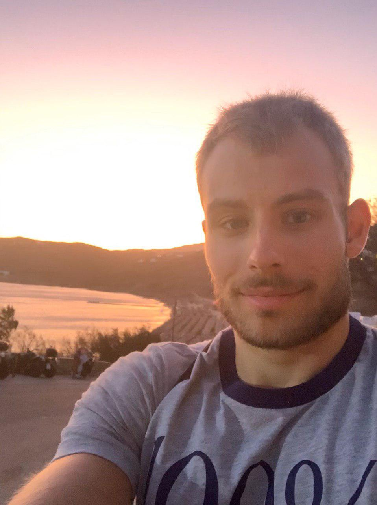
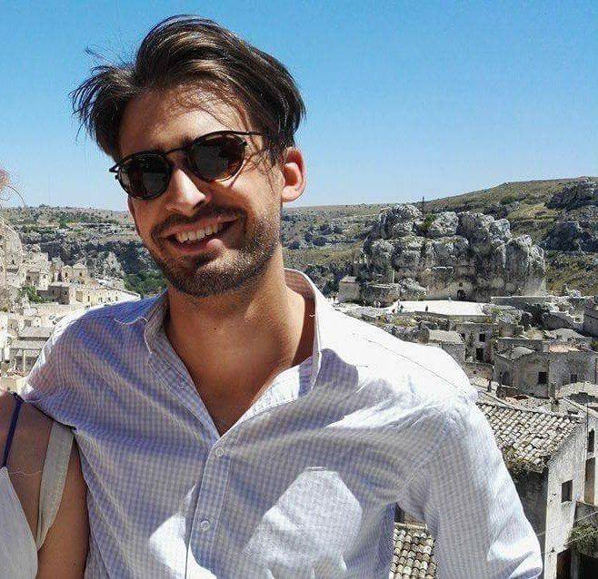
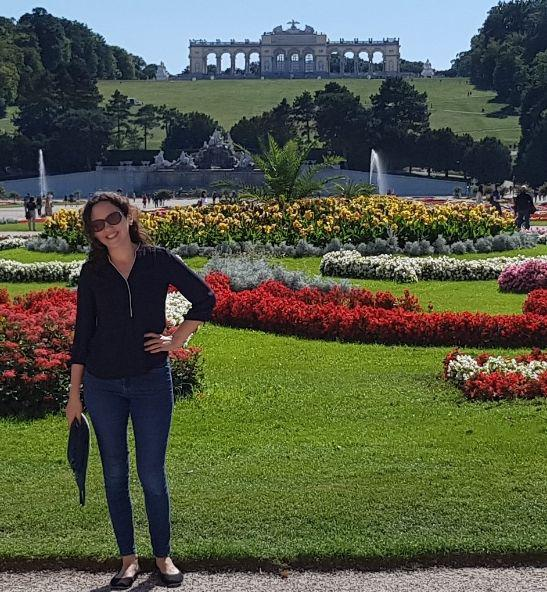
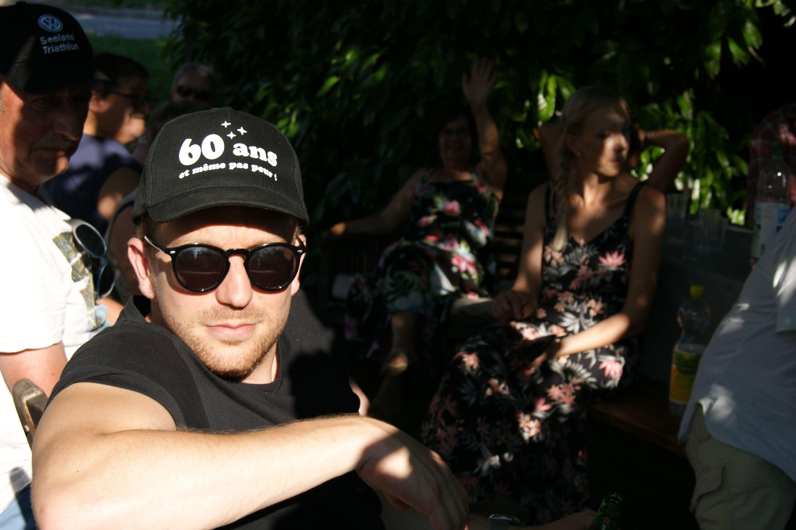
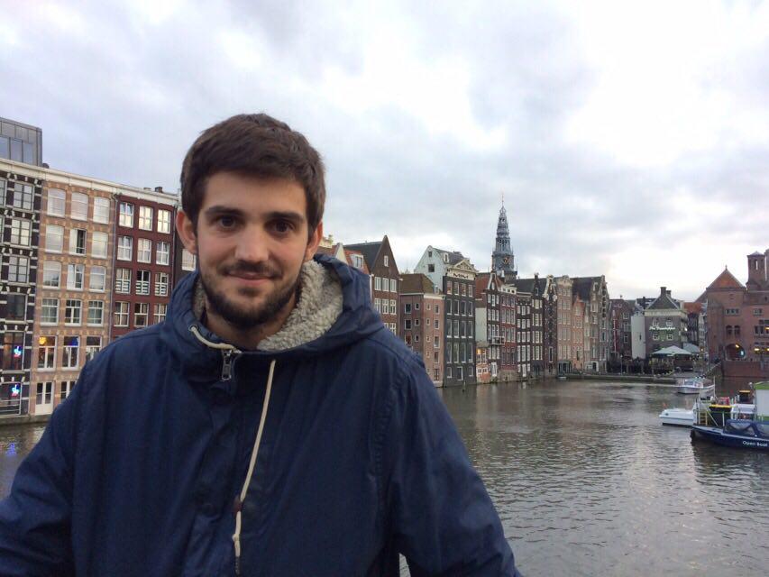

```{r, include=FALSE}

library(knitr)
library(shiny)
library(tidyverse)
library(dplyr)
library(tidyr)
library(kableExtra)
```


# Introduction


Here is our first homework for the course *Programming Tools in Data Science*. Firstly we will present ourselves in a short video. Then a section called group member will provide more information about us. We will present our hobbies and favorite quote, and an individual picture of us will be displayed.

In the last section, called *RMarkdown Syntax*, we will try to demonstrate our Markdown skills!


# Group Members

## Alexandre Schroeter
**Picture**
```{r pressure, echo=FALSE, fig.cap="This picture was taken in August 2019 in Mykonos.", out.width = '30%', fig.align = 'center'}

```

**Hobby**

My favorite hobby is working out. It depends on the time of the year and also if I am on holiday or not but I usually train 4-5 times a week. I have been working with a coach for 2+ years. 

A fact about me: On another level, I am interested in miniature trains. I used to have a train set at my parents'.

**My favorite quote**

> *"Where there is a will, there is a way!"* 

**Timetable**
```{r, echo=FALSE}
text_tbl <- data.frame(
  Subject = c("Programming Tools in Data Science","Unethical Decision Making (Basics)", "Fraud Analytics and Process Mining 2019",  "Text Mining", "Behavioral Economics", "Projects in Data Analytics for Decision Making"),
  Features = c(
    "Tuesday 8:30 am - 12 pm ",
    "Wednesday 10:15 am - 11:45 am", 
    "Wednesday 8:30 am - 12:00 pm",
    "Thursday 8:30 am - 12:00 pm", 
    "Thursday 2:15 pm - 6:00 pm", 
    "Friday 8:30 am - 12:00 pm"
  )
)
kable(text_tbl, col.names = c("Class",
                           "Day and Time")) %>%
  kable_styling(full_width = F) %>%
  column_spec(1, bold = T, border_right = T) %>%
  column_spec(2, border_left = T, background = "lightblue")

```


## Leonard Philippossian
**Picture**
```{r , echo=FALSE, fig.cap="South of Italy, summer 2017", out.width = '30%', fig.align = 'center'}

```

**Hobby**

I always want to understand the world better so my favorite hobby is to learn new stuff. To do so I read a lot and bother my friends with my new facts. A fun fact about programming that I just learned : A Quine is a computer program which takes no input and produces a copy of its own source code as its only output. A quine in R would be : 

```{r, }
(function(x) substitute(x(x)))(function(x) substitute(x(x))) 
```

A fact about me is that I traveled alone around the world with my backpack for one year. During my time in Iran I crossed illegaly the iranien-iraki border with kurdish that were smuggling illegaly alcohol in Iran. 

**My favorite quote**

> *"Alea jacta est"*

**Timetable**

```{r, echo=FALSE}
text_tbl <- data.frame(
  Subject = c("Competitive Strategy in the Digital era", "Supply chain and its latest trend", "Programming Tools in Data Science","Unethical decision making", "Projects in Data Analytics for Decision Making"),
  Features = c(
    "Monday 8:30 am - 12:00 am",
    "Monday 2:00 pm - 6:00 pm",
    "Tuesday 8:00 am - 12:00 am",
    "Wednesday 8:30 am - 12:00 pm",
    "Friday 8:00 am - 12:00 am"
  )
)

kable(text_tbl, col.names = c("Class",
                           "Day and Time")) %>%
  kable_styling(full_width = F) %>%
  column_spec(1, bold = T, border_right = T) %>%
  column_spec(2, border_left = T, background = "lightblue")

```

## Rita Sefraoui

**Picture**
```{r , echo=FALSE, fig.cap="Picture in Vienna, summer 2019", out.width = '30%', fig.align = 'center'}

```

**Hobby**

My favorite hobbies are travelling and watching historical and fashion documentaries.

A fun fact about me : I read the Harry Potter books at least 5 times each... 

**My favorite quote**

> *"Learning never exhausts the mind."* 

**Timetable**
```{r, echo=FALSE}
text_tbl <- data.frame(
  Subject = c("Programming Tools in Data Science", "Human Behavior and Evolutionary Inference",  "Text Mining", "Behavioral Economics", "Projects in Data Analytics for Decision Making"),
  Features = c(
    "Tuesday 8:30 am - 12 pm ",
    "Tuesday 2:15 pm - 6:00 pm ", 
    "Thursday 8:30 am - 12:00 pm", 
    "Thursday 2:15 pm - 6:00 pm", 
    "Friday 8:30 am - 12:00 pm"
  )
)

kable(text_tbl, col.names = c("Class",
                           "Day and Time")) %>%
  kable_styling(full_width = F) %>%
  column_spec(1, bold = T, border_right = T) %>%
  column_spec(2, border_left = T, background = "lightblue")

```


## Simon Fornerod
**Picture**
```{r, echo=FALSE,fig.cap="_My father's birthday party, july 2019_",out.width = '30%', fig.align = 'center'}
    
```

**Hobby**
I like sport in general and I therefore practice a certain number of them. Indeed, I play football, tennis and also running.
I am also a music lover, unfortunately I don't have the musical talent to play it but I enjoy going to concerts or going to festivals.

**My favorite quote**

> *"Per Aspera Ad Astra"*

**Timetable**
```{r, echo=FALSE}
text_tbl <- data.frame(
  Subject = c("Programming Tools in Data Science", "Computational Complexity",  "Text Mining", "Stratégies Digitales", "Projects in Data Analytics for Decision Making"),
  Features = c(
    "Tuesday 8:30 am - 12 pm ",
    "Tuesday 2:15 pm - 6:00 pm ", 
    "Thursday 8:40 am - 12:00 pm", 
    "Thursday 2:15 pm - 6:00 pm", 
    "Friday 8:30 am - 12:00 pm"
  )
)

kable(text_tbl, col.names = c("Subject",
                           "Day and Time")) %>%
  kable_styling(full_width = F) %>%
  column_spec(1, bold = T, border_right = T) %>%
  column_spec(2, border_left = T, background = "lightblue")

```


## David Pitteloud


**Picture**

```{r , echo=FALSE, fig.cap="This picture was taken in Amsterdam, autumn 2017", out.width = '30%', fig.align = 'center'}

```

**Hobby**

My favorite hobby is fly fishing. The purpose of fly fishing is to build on a hook an imitation of an insect with natural materials such as feathers. Then with a special rod, the fly is projected by the weight of a lather and a kind of lash movement. The purpose is to imitate the landing of a fly on a stream in order to provoke an attack of a trout or any other fish. 

A fact about me is that I was born in a village in the mountain with less than 50 people living all year long. In addition, I do live directly on the ski slope.


**My favorite quote** 

> *"The moutainmen leaves his village but his village never leaves him"*


**Timetable**

```{r, echo=FALSE}
text_tbl <- data.frame(
  Subject = c("Competitive Strategy in the Digital era", "Supply chain and its latest trend", "Programming Tools in Data Science","Unethical decision making", "Projects in Data Analytics for Decision Making"),
  Features = c(
    "Monday 8:30 am - 12:00 am",
    "Monday 2:00 pm - 6:00 pm",
    "Tuesday 8:00 am - 12:00 am",
    "Wednesday 8:30 am - 12:00 pm",
    "Friday 8:00 am - 12:00 am"
  )
)

kable(text_tbl, col.names = c("Class",
                           "Day and Time")) %>%
  kable_styling(full_width = F) %>%
  column_spec(1, bold = T, border_right = T) %>%
  column_spec(2, border_left = T, background = "lightblue")

```


# RMarkdown Syntax

## Normal distribution

```{r , echo=FALSE}
set.seed(1)
x<-rnorm(100, mean = 0, sd = 1)
meanX<-mean(x)
medianX<-median(x)
varianceX<-var(x)

tblNorm <- data.frame(meanX, medianX, varianceX)


kable(tblNorm, col.names = c("Mean of X", "Median of X", "Variance of X")) %>%
  kable_styling(full_width = F) %>%
  column_spec(1, bold = F, border_right = T) %>%
  column_spec(2, border_left = T, background = "lightblue")
```

Our results are not the expected 0, 0 and 1. Instead we get 0.109, 0.113 and 0.807 respectively. 
This is probably due to the fact that with 100 random numbers , we do not have a sample large enough to be representative of the theory. If we try the same with 1000 numbers we get closer, and theoretically the bigger the sample the closer we should get to 0, 0 and 1: 

```{r , echo=FALSE}
set.seed(1)
x2<-rnorm(1000, mean = 0, sd = 1)
meanX2<-mean(x2)
medianX2<-median(x2)
varianceX2<-var(x2)

tblNorm2 <- data.frame(meanX2, medianX2, varianceX2)


kable(tblNorm2, col.names = c("Mean of X2", "Median of X2", "Variance of X2")) %>%
  kable_styling(full_width = F) %>%
  column_spec(1, bold = F, border_right = T) %>%
  column_spec(2, border_left = T, background = "lightblue")
```

Here we represent the histogram of the distribution of x:

```{r , echo=FALSE, warnings=FALSE,comment=FALSE, message=FALSE, fig.cap="Histogram of the simulation"}
xData<-data.frame(x)
ggplot(data=xData, 
       aes(xData$x)) + 
  geom_histogram(color="blue",
                 fill="blue",
                 alpha=.2)+
  theme_minimal()+
  ggtitle("Distribution of x")+
  ylab("count")+
  xlab(element_blank())+
  theme(plot.title = element_text(hjust = 0.5))
  

```


## Equation

\[\mathbb{E}\left[var\Big\{\mathbf{v_1}\Big(\mathbf{\boldsymbol{\hat\theta}},n\Big) \Big|\mathbf{\boldsymbol{\hat \theta}}\Big\}\right]
= var\{\mathbf{v_1} (\mathbf{\boldsymbol{\hat \theta_0}}), n\} +
\mathbb{E} \left[ \mathcal{O}_p \Big\{ \mathbf{D_1} (\boldsymbol{\theta^*}, n)(\boldsymbol{\hat\theta}-\boldsymbol{\theta_0}), \cdots, \mathbf{D_p}(\boldsymbol{\theta^*}, n)(\boldsymbol{\hat \theta} - \boldsymbol{\theta_0}) \Big\}\right] 
= var\{\mathbf{v_1}(\boldsymbol{\theta_0}, n)\} + \mathcal{O}_p(n^{-2})
\]

\[\mathbf{A} \equiv [a_{i,j}]_{i,j = 1,\dots,p}\]

## Cache issue 

```{r random, cache = TRUE}
set.seed(3)
random.num <- runif(1) #generate a random number between 0 and 1 with uniform distribution 

random.num

```

##Wrong 
```{r, cache = TRUE}

print(paste0("the random number is: ",random.num ))

```

##Right 
```{r, cache = TRUE, dependson = "random"}

print(paste0("the random number is: ",random.num ))
```


# Quote
><span style="color:blue">*"Vérité dans un temps, erreur dans un autre.”, Charles de Montesquieu*</span>

# More Info Button
```{r, echo=FALSE}
ui <- navbarPage("Hidden information", id = "tabs",
  navbarMenu("More",
    tabPanel("Hide Emails"), 
    "------",
    tabPanel("Alex","alex.schroeter@unil.ch"),
    tabPanel("Léo","leonard.philippossian@unil.ch"),
    tabPanel("Rita","rita.sefraouni@unil.ch"),
    tabPanel("Simon","simon.fornerod@unil.ch"),
    tabPanel("David","david.pitteloud@unil.ch"),
    "------",
    "This option allows you to display the Emails of the group members"
  )
)

server <- function(input, output, session) {
  observeEvent(input$hideMenu, {
    hideTab(inputId = "tabs", target = "More")
  })

  observeEvent(input$showMenu, {
    showTab(inputId = "tabs", target = "More")
  })
}

shinyApp(ui, server)
```

# Blue box
<style>
div.blue pre { background-color:lightblue; }
div.blue pre { color:white; }
</style>

<div class = "blue">
```{r}
summary(PlantGrowth)
```
</div>

#References
