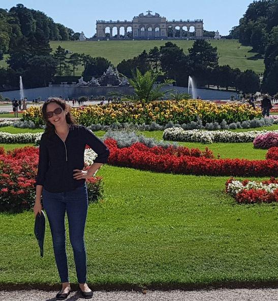
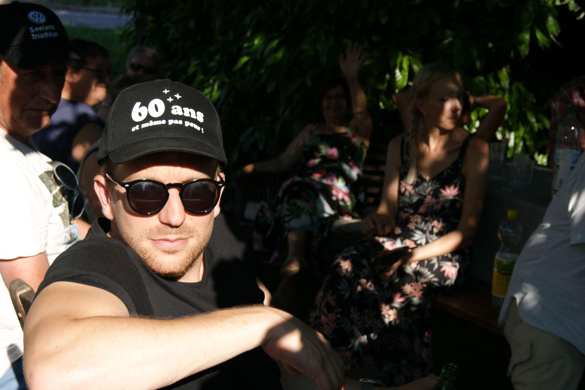
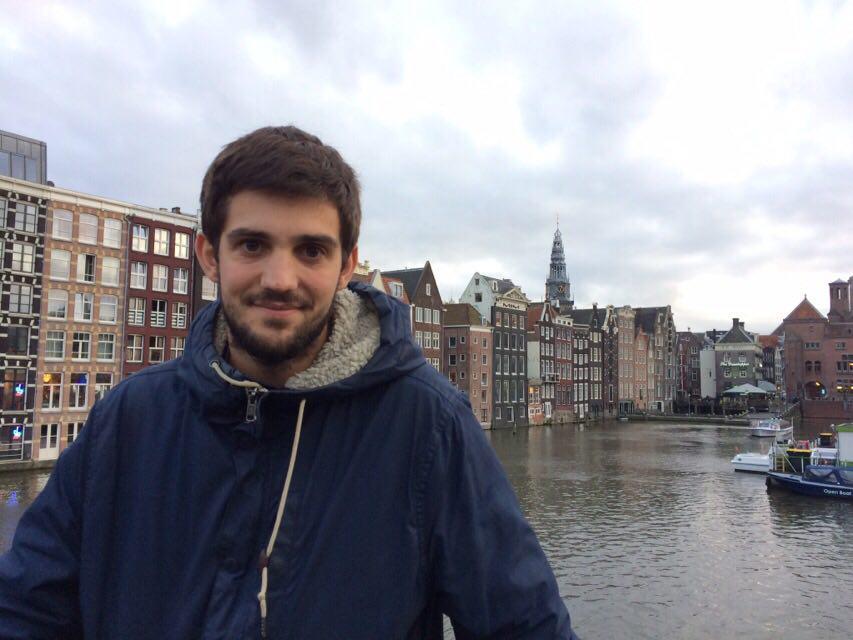

```{r, include=FALSE}

library(knitr)
library(shiny)
library(tidyverse)
library(dplyr)
library(tidyr)
library(kableExtra)
```


# Introduction


Here is our first homework for the course *Programming Tools in Data Science*. 

Firstly, we will present our group in a short video. Then a section called group member will provide more information about us. Each of us will present his/her hobbies and favorite quote as well as an individual picture.

In the last section, called *RMarkdown Syntax*, we will try to demonstrate our RMarkdown skills by dealing with a cache issue, simulating some samples from a normal distribution, adding some equations and quotes!


<div style="text-align:center;">
<video width="640" height="480" controls>
  <source src="../figures/ptdsvid.mov" type="video/mp4">
</video>
</div>


# Group Members

## Alexandre Schroeter
**Picture**
```{r pressure, echo=FALSE, fig.cap="Mykonos, August 2019", out.width = '30%', fig.align = 'center'}
knitr::include_graphics("../figures/alex.jpg")
```

**Hobby**

My favorite hobby is working out. It depends on the time of the year and also if I am on holiday or not, but I usually train 4-5 times a week. I have been working with a coach for 2+ years. 

A fact about me: On another level, I am interested in miniature trains. I used to have a train set at my parents'.

**My favorite quote**

> *"Where there is a will, there is a way!"* 

**Timetable**
```{r, echo=FALSE}
text_tbl <- data.frame(
  Class = c("Programming Tools in Data Science","Unethical Decision Making (Basics)", "Fraud Analytics and Process Mining 2019",  "Text Mining", "Behavioral Economics", "Projects in Data Analytics for Decision Making"),
  Schedule = c(
    "Tuesday 8:30 am - 12:00 pm ",
    "Wednesday 10:15 am - 11:45 am", 
    "Wednesday 8:30 am - 12:00 pm",
    "Thursday 8:30 am - 12:00 pm", 
    "Thursday 2:15 pm - 6:00 pm", 
    "Friday 8:30 am - 12:00 pm"
  )
)

kable(text_tbl) %>%
  kable_styling(c("striped", "bordered"), full_width = F) %>%
  column_spec(1, bold = T, border_right = TRUE) %>%
  column_spec(2, border_right = TRUE)


```


## Leonard Philippossian
**Picture**
```{r , echo=FALSE, fig.cap="South of Italy, summer 2017", out.width = '30%', fig.align = 'center'}

```

**Hobby**

I always want to understand the world better so my favorite hobby is to learn new stuff. To do so I read a lot and bother my friends with my new facts. A fun fact about programming that I just learned : A Quine is a computer program which takes no input and produces a copy of its own source code as its only output. A quine in R would be : 

```{r, }
(function(x) substitute(x(x)))(function(x) substitute(x(x))) 
```

A fact about me is that I traveled alone around the world with my backpack for one year. During my time in Iran I crossed illegaly the iranien-iraki border with kurdish that were smuggling illegaly alcohol in Iran. 

**My favorite quote**

> *"Alea jacta est"*

**Timetable**

```{r, echo=FALSE}
text_tbl <- data.frame(
  Class = c("Competitive Strategy in the Digital era", "Supply chain and its latest trend", "Programming Tools in Data Science","Unethical decision making", "Projects in Data Analytics for Decision Making"),
  Schedule = c(   
    "Monday 8:30 am - 12:00 am",
    "Monday 2:15 pm - 6:00 pm",
    "Tuesday 8:30 am - 12:00 am",
    "Wednesday 10:15 am - 12:00 pm",
    "Friday 8:30 am - 12:00 am"
    )
)
 
kable(text_tbl) %>%
  kable_styling(c("striped", "bordered"), full_width = F) %>%
  column_spec(1, bold = T, border_right = TRUE) %>%
  column_spec(2, border_right = TRUE)


```

## Rita Sefraoui

**Picture**
```{r , echo=FALSE, fig.cap="Picture in Vienna, summer 2019", out.width = '30%', fig.align = 'center'}

```

**Hobby**

My favorite hobbies are travelling and watching historical and fashion documentaries.

A fun fact about me : I read the Harry Potter books at least 5 times each... 

**My favorite quote**

> *"Learning never exhausts the mind."* 

**Timetable**
```{r, echo=FALSE}
text_tbl <- data.frame(
  Class = c("Programming Tools in Data Science", "Human Behavior and Evolutionary Inference",  "Text Mining", "Behavioral Economics", "Projects in Data Analytics for Decision Making"),
  Schedule = c(
    "Tuesday 8:30 am - 12:00 pm",
    "Tuesday 2:15 pm - 6:00 pm", 
    "Thursday 8:30 am - 12:00 pm", 
    "Thursday 2:15 pm - 6:00 pm", 
    "Friday 8:30 am - 12:00 pm"
  )
)


kable(text_tbl) %>%
  kable_styling(c("striped", "bordered"), full_width = F) %>%
  column_spec(1, bold = T, border_right = TRUE) %>%
  column_spec(2, border_right = TRUE)
```


## Simon Fornerod
**Picture**
```{r, echo=FALSE,fig.cap="_My father's birthday party, july 2019_",out.width = '30%', fig.align = 'center'}
    
```

**Hobby**
I like sport in general and I therefore practice a certain number of them. Indeed, I play football, tennis and also running.
I am also a music lover, unfortunately I don't have the musical talent to play it but I enjoy going to concerts or going to festivals.

A fun fact about me : I was hitching at 5 am after a tumultuous evening, and instead of going home with a car, it was with a tractor...

**My favorite quote**

> *"Ad Astra Per Aspera"*

**Timetable**
```{r, echo=FALSE}
text_tbl <- data.frame(
  Class = c("Programming Tools in Data Science", "Computational Complexity",  "Text Mining", "Stratégies Digitales", "Projects in Data Analytics for Decision Making"),
  Schedule = c(
    "Tuesday 8:30 am - 12:00 pm",
    "Tuesday 2:15 pm - 6:00 pm", 
    "Thursday 8:30 am - 12:00 pm", 
    "Thursday 2:15 pm - 6:00 pm", 
    "Friday 8:30 am - 12:00 pm"
  )
)


kable(text_tbl) %>%
  kable_styling(c("striped", "bordered"), full_width = F) %>%
  column_spec(1, bold = T, border_right = TRUE) %>%
  column_spec(2, border_right = TRUE)
```


## David Pitteloud


**Picture**

```{r , echo=FALSE, fig.cap="Amsterdam, autumn 2017", out.width = '30%', fig.align = 'center'}

```

**Hobby**

My favorite hobby is fly fishing. The purpose of fly fishing is to build on a hook an imitation of an insect with natural materials such as feathers. Then with a special rod, the fly is projected by the weight of a lather and a kind of lash movement. The purpose is to imitate the landing of a fly on a stream in order to provoke an attack of a trout or any other fish. 

A fact about me is that I was born in a village in the mountain with less than 50 people living all year long. In addition, I do live directly on the ski slope.


**My favorite quote** 

> *"Somebody just back of you while you are fishing is as bad as someone looking over your shoulder while you write a letter to your girl."*


**Timetable**

```{r, echo=FALSE}
text_tbl <- data.frame(
  Class = c("Competitive Strategy in the Digital era", "Supply chain and its latest trend", "Programming Tools in Data Science","Unethical decision making", "Projects in Data Analytics for Decision Making"),
  Schedule = c(   
    "Monday 8:30 am - 12:00 am",
    "Monday 2:15 pm - 6:00 pm",
    "Tuesday 8:30 am - 12:00 am",
    "Wednesday 10:15 am - 12:00 pm",
    "Friday 8:30 am - 12:00 am"
    )
)
 
kable(text_tbl) %>%
  kable_styling(c("striped", "bordered"), full_width = F) %>%
  column_spec(1, bold = T, border_right = TRUE) %>%
  column_spec(2, border_right = TRUE)

```


# RMarkdown Syntax


## Cache issue 

The cache issue emerge when the document Rmarkdown is generated more than once with <mark>cache = TRUE</mark> and that some change in the data or code have been introduced in-between . 


To show how we can have a cache issue we first set an initial seed of value 3 to generate a random number between 0 and 1 with uniform distribution. This number is 0.168.

```{r random, cache = TRUE, echo=FALSE}

seed <- 3 
set.seed(seed) #the cache issue will appear if seed is changed 
random.num <- round(runif(1), 3) #generate a random number between 0 and 1 with uniform distribution 

```

The current value of the random number is <b>`r random.num`</b>. This number was generated from the seed <b>`r seed`</b>. 


###Wrong 

```{r, cache = TRUE, echo=FALSE}

wrong.num <- random.num

```
The random number is <b>`r wrong.num`</b>.


###Right 

```{r, cache = TRUE, dependson = "random", echo=FALSE}

right.num <- random.num

```
The random number is <b>`r right.num`</b>.

The Rmarkdown must be generated two time with a different seed the second time to see the cache error.

On the second document we can notice that when the seed is changed to number <b>`r seed`</b> instead of 3 we get the random number <b>`r random.num`</b> which is different than 0.168. But in the Wrong section when the random number is called it's still the value 0.168. Because in the chunk the argument <mark>dependson = "random"</mark> was forgotten. 


## Normal distribution
Let us define a random variable $Y \sim \mathcal{N}(0,1)$ and 2 samples; $X_1$ and $X_2$ whose sizes are respectively 100 and 1000. 

```{r , echo=FALSE}
set.seed(1)
x<-rnorm(100, mean = 0, sd = 1)
meanX<-mean(x)
medianX<-median(x)
varianceX<-var(x)

tblNorm <- data.frame(meanX, medianX, varianceX)


kable(tblNorm, col.names = c("Mean of $X_1$", "Median of $X_1$", "Variance of $X_1$")) %>%
  kable_styling(bootstrap_options = "striped", full_width = F) %>%
  column_spec(1, bold = F) %>%
  column_spec(2, background = "orange")
```

Our results are not the expected 0, 0 and 1. Instead we get 0.109, 0.113 and 0.807 respectively. 
This is probably due to the fact that with 100 random numbers , we do not have a sample large enough to be representative of the theory. If we try the same with 1000 numbers we get closer, and theoretically the bigger the sample the closer we should get to 0, 0 and 1: 

```{r , echo=FALSE}
set.seed(1)
x2<-rnorm(1000, mean = 0, sd = 1)
meanX2<-mean(x2)
medianX2<-median(x2)
varianceX2<-var(x2)

tblNorm2 <- data.frame(meanX2, medianX2, varianceX2)


kable(tblNorm2, col.names = c("Mean of $X_2$", "Median of $X_2$", "Variance of $X_2$")) %>%
  kable_styling(bootstrap_options = "striped",full_width = F) %>%
  column_spec(1, bold = F) %>%
  column_spec(2,background = "orange")
```

Here we represent the histogram of $X_1$:

```{r , echo=FALSE, warnings=FALSE,comment=FALSE, message=FALSE, fig.cap="Histogram of the simulation", fig.align='center'}

xData<-data.frame(x)
ggplot(data=xData, 
       aes(xData$x)) + 
  geom_histogram(color="blue",
                 fill="blue",
                 alpha=.2)+
  theme_minimal()+
  ggtitle(bquote("Empirical distribution of" ~ X[1]))+
  ylab("Count")+
  xlab(element_blank())+
  theme(plot.title = element_text(hjust = 0.5))
  

```


## Equation

\[\mathbb{E}\left[var\Big\{\mathbf{v_1}\Big(\mathbf{\boldsymbol{\hat\theta}},n\Big) \Big|\mathbf{\boldsymbol{\hat \theta}}\Big\}\right]
= var\{\mathbf{v_1} (\mathbf{\boldsymbol{\theta_0}}), n\} +
\mathbb{E} \left[ \mathcal{O}_p \Big\{ \mathbf{D_1} (\boldsymbol{\theta^*}, n)(\boldsymbol{\hat\theta}-\boldsymbol{\theta_0}), \cdots, \mathbf{D_p}(\boldsymbol{\theta^*}, n)(\boldsymbol{\hat \theta} - \boldsymbol{\theta_0}) \Big\}\right] 
= var\{\mathbf{v_1}(\boldsymbol{\theta_0}, n)\} + \mathcal{O}_p(n^{-2})
\]

\[\Large \mathbf{A} \equiv [a_{i,j}]_{i,j = 1,\dots,p}\]


# Quote
><span style="color:blue">*"Vérité dans un temps, erreur dans un autre.”, Charles de Montesquieu*</span>

# More info button
```{r, echo=FALSE}

```
<script>
function myFunction() {
    var x = document.getElementById("myDIV");
    if (x.style.display === "none") {
        x.style.display = "block";
    } else {
        x.style.display = "none";
    }
}
</script>
 
<button onclick="myFunction()">More info ? Click here</button>
 
<div id="myDIV">
 
We were able to use some HTML and JavaScript to create this toggle. 
 
</div>

# Blue box
<style>
div.blue pre { background-color:lightblue; }
div.blue pre { color:white; }
</style>

<div class = "blue">
```{r}
summary(PlantGrowth)
```
</div>

# References
* @quote1
* @quote2
* @quote3
* @quote4
* @quote5
* @montes